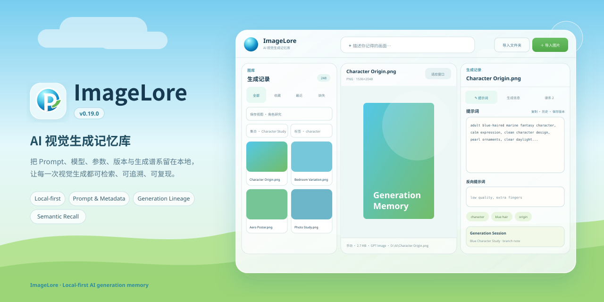

# ImageLore v0.24.0




ImageLore 是一个 local-first 的 AI 视觉生成记忆库，用来保存图片背后的 Prompt、模型、参数、历史版本、集合与生成谱系，并让这些信息在几个月以后仍然可以继续使用。

## 应用预览

仓库内的 `docs/og.svg` 是可编辑的 OG / README 视觉源；合并到主线后由 GitHub Actions 自动渲染 `docs/og.png`（1280×640），可直接用于 GitHub Social Preview。

## 当前核心

- 简体中文 Frutiger Aero 桌面界面
- 图片 / 文件夹 / 原生拖拽导入
- 资料源目录：启动时自动同步或一键同步常用出图目录
- Semantic Recall：本地 CLIP 图文向量搜索，支持自然语言描述找图与“查找相似图片”
- Hybrid Search：语义结果可继续叠加模型、Seed、Sampler、Steps、CFG、构图方向等 Generation Explorer 条件
- AI 索引管理：按图片指纹增量更新，可取消、清空与重建；模型首次使用按需下载，之后可离线运行
- Generation Explorer：按 Seed / Steps / Sampler / Scheduler / CFG / Denoise / 元数据来源 / 构图方向筛选与排序
- Saved View 2.0：保存完整高级筛选与排序；多选支持收藏、元数据重读和 Generation Session 分配
- 后台导入任务、实时进度与取消
- SHA-256 精确重复内容检测与自动跳过
- Prompt、Negative Prompt、模型、标签自动保存
- Visual DNA：主体 / 角色 / 服装 / 姿势 / 表情 / 构图 / 镜头 / 光线 / 环境 / 色彩 / 材质 / 风格的结构化记录
- Prompt Card：把 Prompt、模型、尺寸、Visual DNA 与谱系上下文汇总成一张研发卡片
- Image to Prompt：从当前图片生成结构化 Visual DNA 与可生成 Prompt
- Remix Workspace：从多张参考图选择 Visual DNA 片段并组合新 Prompt，结果自动进入 Generation Lineage
- Image to Prompt：调用可配置的 OpenAI-compatible 视觉模型，把当前图片拆成结构化 Visual DNA + 可生成 Prompt
- AI 分析结果保留 Provider / 模型 / 时间；默认只补充 Visual DNA 空字段，可载入 Prompt 编辑器或保存为独立 Revision
- Vision API Key 仅保存在当前进程内存，也可由 IMAGELORE_VISION_API_KEY 环境变量提供，不写入 SQLite / Sidecar / 日志
- Visual DNA 进入本地 FTS / CJK 搜索，并随 Sidecar v3 导入导出
- Prompt Revision 历史版本；保存版本会原子写入当前编辑内容，避免 autosave 竞态
- 图库右键菜单可直接在文件管理器中定位原图
- Semantic Security Hardening：固定 CLIP revision、ONNX SHA-256 / 大小校验、可信缓存原子安装
- Collection 与多父 Generation Lineage
- 全库搜索式父图选择器
- 父子 Prompt Diff
- Tag 重命名 / 合并 / 删除
- Collection 重命名 / 删除
- SQLite FTS + CJK 子串搜索；3 字及以上 CJK 查询使用本地 trigram 候选索引加速，最终仍以原有子串规则校验
- 虚拟化图库 + 持久化 WebP 缓存
- 本地 asset protocol 图片传输，不再通过 Base64 IPC 搬运大图
- 1 GB 缓存治理
- A1111 / ComfyUI / NovelAI / InvokeAI / 通用 JSON Metadata Adapter
- ComfyUI Prompt / Negative / Model / Seed / Steps / CFG / Sampler 等提取
- 每 24 小时自动数据库备份、手动备份、完整性验证与安全恢复
- 启动故障自动恢复：数据库无法打开时保留损坏原件，并尝试最近可验证备份
- 本地 rotating logs：1 MB × 5 份，并在资料库管理中提供数据 / 日志目录入口
- 缺失文件重定位
- Sidecar v3：Portable ID + fingerprint 跨库谱系恢复
- Generation Session 与 Branch Notes
- 父子图片并排 Compare + Prompt Diff
- Model Alias / normalization
- 保存筛选视图与 Library Health
- .imagelore.json Sidecar
- Windows NSIS 一键安装包；v0.20.0 起支持经过 CI 实测的旧版原位覆盖升级

## 数据位置

主数据库：

`%LOCALAPPDATA%\app.imagelore.desktop\library.sqlite3`

备份：

`%LOCALAPPDATA%\app.imagelore.desktop\backups\`

缓存：

`%LOCALAPPDATA%\app.imagelore.desktop\cache\`

本地语义模型：

`%LOCALAPPDATA%\app.imagelore.desktop\models\`

诊断日志：

`%LOCALAPPDATA%\app.imagelore.desktop\logs\`

原始图片始终保留在原位置，不会复制进 SQLite；从 ImageLore 删除记录也不会删除原始图片。

从 v0.19.x 或更早版本升级到 v0.20.0 时，旧 `%LOCALAPPDATA%\\ImageLore` 中的数据库、备份与本地语义模型会在首次启动时自动迁移到新的独立数据目录；安装程序本身仍原位覆盖旧版本。

## 快捷键

- `Ctrl+F` 搜索
- `Ctrl+I` 导入图片
- `Ctrl+S` 保存当前编辑并建立 Prompt 版本
- `Ctrl+Shift+C` 复制 Prompt
- `F6` 聚焦 Prompt
- `F7` 切换适应窗口 / 100%
- `Alt+↑ / Alt+↓` 前后切图

## 开发

普通提交只运行快速 CI；只有手动发布或版本标签才生成 Windows 安装包。

```bash
npm ci
npm run check
npm run tauri:dev
```

正式 Windows 构建：

```bash
npm run tauri:build
```

## 版本

`VERSION` 是唯一的**当前应用版本**来源。`version:sync` 会自动同步 npm、Tauri、Cargo、前端运行时、README、静态 UI 预览与 OG SVG；`version:check` 会逐项校验。`docs/og.png` 由 OG SVG 在 GitHub Actions 中自动重绘。`CHANGELOG.md`、`ROADMAP.md` 与数据库 `schema_version` 分别表示历史里程碑和数据库结构版本，刻意保持独立：

```bash
npm run version:sync
npm run version:check
npm run version:patch
npm run version:minor
npm run version:major
```
